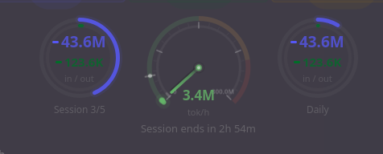

# AI Stat

Real-time KDE Plasma 6 widget for monitoring local AI coding tools and API quotas in one place.

<p align="center">
  
</p>

## Features

- Multi-service tabs: **Claude Code**, **Gemini CLI**, **Copilot CLI**, **OpenCode**, **Kiro**, **Antigravity**, and optional **Gemini API**
- Standardized top dashboard layout across CLI-style tabs (centered meter row)
- Sticky popup pin and configurable popup height
- 12-hour trend chart and 8-day history where data is available
- Meter fallbacks for low-activity periods (uses last active window/averages when current window is empty)
- Active sessions + recent sessions lists
- Copilot active-session counting based on recent turns for better accuracy
- Clickable local paths/directories (opens file manager via system URL handler)
- Per-model/token breakdowns and quota/credit visualizations
- Compact panel indicator with configurable target service/stat

## Service coverage

| Service | Data source | Highlights |
|---|---|---|
| Claude Code | `~/.claude/` telemetry/sessions/history | Session-window quotas, live throughput, token/cost charts, last-active 12h fallback |
| Gemini CLI | `~/.gemini/` chats/settings | Request quota, token trends, active-session process polling, last-active 12h fallback |
| Copilot CLI | `~/.copilot/session-store.db` | Turns/sessions totals, active sessions from recent turns, 12h + daily charts |
| OpenCode | `~/.local/share/opencode/opencode.db` | Token usage, sessions, models, throughput |
| Kiro | `~/.kiro/` + `~/.config/Kiro/User/workspaceStorage` | Installed powers, extensions, running status, credit meter, recent workspace directories |
| Antigravity | Local language server API | Credits, model/session activity, token trends |
| Gemini API | `countTokens` endpoint | Request/token remaining limits per model |

<p align="center">
  
</p>

## Installation

```bash
bash build.sh
kpackagetool6 -t Plasma/Applet -i ai-stat.plasmoid
```

## Upgrade

```bash
bash build.sh
kpackagetool6 -t Plasma/Applet -u ai-stat.plasmoid
```

## Configuration

Right-click the widget and select **Configure...**.

| Setting | Description |
|---|---|
| Service toggles | Enable/disable individual tabs |
| Refresh interval | Data polling interval (60-900s) |
| Popup height | Vertical size of popup content area |
| Pin popup open | Keep popup sticky until unpinned |
| Panel indicator | Quota ring or tachometer in compact mode |
| Compact service/stat | Which service/stat compact mode displays |
| Show costs / Monthly budget | Cost display and budget threshold |
| Claude daily limits | Optional manual token-limit override (`0 = auto`) |
| Gemini API key | Enables Gemini API limits tab |

### Default settings template

Default config values are defined in:

- `ai-stat/contents/config/main.xml` (kcfg defaults)
- `ai-stat/contents/ui/configGeneral.qml` (config UI bindings)

## Architecture

```
local_stats.py         -> Claude Code tab data
gemini_local_stats.py  -> Gemini CLI tab data
copilot_stats.py       -> Copilot CLI tab data
opencode_stats.py      -> OpenCode tab data
kiro_stats.py          -> Kiro tab data
antigravity_stats.py   -> Antigravity tab data
gemini_stats.py        -> Gemini API limits
/proc/pid/io polling   -> live throughput tachometers
```

## Build and packaging notes

- `build.sh` packages `metadata.json` + `contents/` at archive root (required by `kpackagetool6`).
- Build excludes temporary files (`__pycache__`, `*.pyc`, `*.backup`, editor backups).
- If installed via a symlinked development path, source edits are live; package rebuild is only needed for distributable zip/install workflows.

## Requirements

- KDE Plasma 6
- Python 3
- One or more supported tool installations/accounts for the tabs you enable

## Credits

Built with [Claude Code](https://claude.ai/code)
