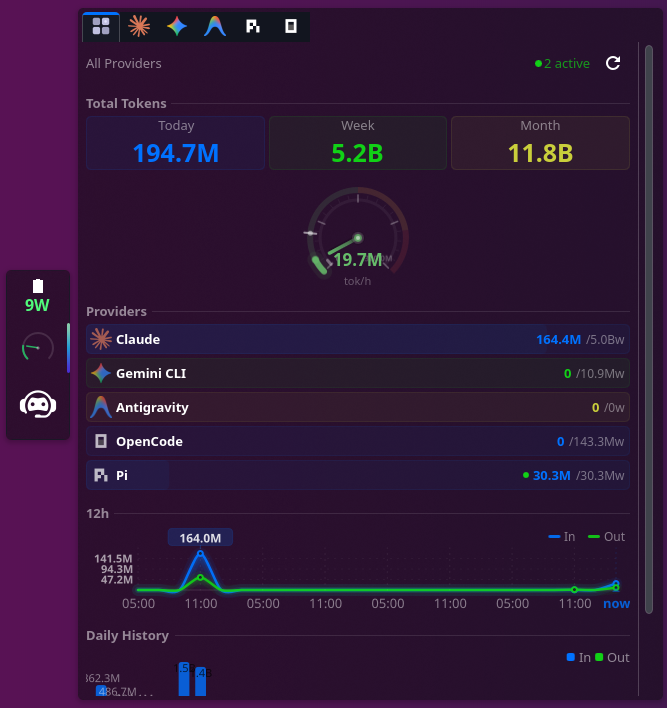

# OhMyToken

Real-time KDE Plasma 6 widget for monitoring AI coding tools in one dashboard: quotas, throughput, sessions, trends, and costs.

<p align="center">
  
</p>

## Tabs and data sources

| Tab | Source | Highlights |
|---|---|---|
| Summary | Aggregated from enabled providers | Total tokens, combined throughput, merged trend charts, provider rows for all active tabs (including Copilot CLI + Kiro) |
| Claude Code | `~/.claude/` telemetry/sessions/history | Session-window quotas, token/cost trends, live activity |
| Gemini CLI | `~/.gemini/` chats/settings | Request quota, token trends, active-session polling |
| Pi | `~/.pi/agent/` sessions/settings | Token + cost tracking, prompts, model/provider breakdown |
| OpenCode | `~/.local/share/opencode/opencode.db` | Token usage, sessions, models, throughput |
| Antigravity | Local language-server API | Credits, model/session activity, token trends |
| Copilot CLI | `~/.copilot/session-store.db` | Turns/sessions totals, active sessions from recent turns |
| Kiro | `~/.kiro/` + `~/.config/Kiro/User/workspaceStorage` | Running status, powers/extensions, credits, recent directories |
| Gemini API | `countTokens` endpoint | Request/token remaining limits per model |

## Features

- Unified multi-tab dashboard with configurable per-service visibility
- Sticky popup pin + adjustable popup height
- Live tachometer from `/proc/<pid>/io` polling
- 12h and daily charts where service data exists
- Meter fallback behavior for low-activity windows
- Clickable local paths/directories (opens file manager)
- Compact panel indicator with selectable service/stat target
- Copilot active-session counting from recent turn activity

## Installation

```bash
bash build.sh
kpackagetool6 -t Plasma/Applet -i ohmytoken.plasmoid
```

## Upgrade

```bash
bash build.sh
kpackagetool6 -t Plasma/Applet -u ohmytoken.plasmoid
```

## Remove

```bash
kpackagetool6 -t Plasma/Applet -r ohmytoken
```

## Development (symlink)

```bash
ln -s /path/to/plasmoid-ohmytoken/ohmytoken ~/.local/share/plasma/plasmoids/ohmytoken
```

Edits under `ohmytoken/` are live immediately when using a symlinked install.

## Configuration

Right-click the widget and choose **Configure...**.

Key options:
- Service toggles (including Pi, Copilot CLI, Kiro)
- Refresh interval
- Popup height
- Pin popup open
- Compact indicator style + target service/stat
- Cost display and monthly budget
- Claude daily limit overrides (`0 = auto`)
- Gemini API key

Default config template files:
- `ohmytoken/contents/config/main.xml`
- `ohmytoken/contents/ui/configGeneral.qml`

## Architecture

```text
local_stats.py         -> Claude tab
gemini_local_stats.py  -> Gemini CLI tab
pi_stats.py            -> Pi tab
opencode_stats.py      -> OpenCode tab
antigravity_stats.py   -> Antigravity tab
copilot_stats.py       -> Copilot tab
kiro_stats.py          -> Kiro tab
gemini_stats.py        -> Gemini API tab
/proc/pid/io polling   -> live tachometer activity
```

## Build and packaging notes

- `build.sh` packages from `ohmytoken/` with `metadata.json` and `contents/` at archive root.
- Temporary/debug files are excluded from the distributable archive.

## Requirements

- KDE Plasma 6
- Python 3
- Linux (`/proc` required for live I/O activity polling)
- At least one supported tool/account for the tabs you enable

## License

GPL-3.0+
